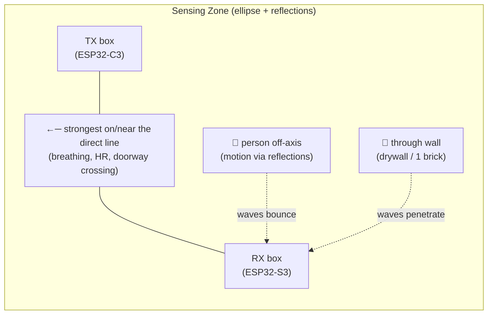
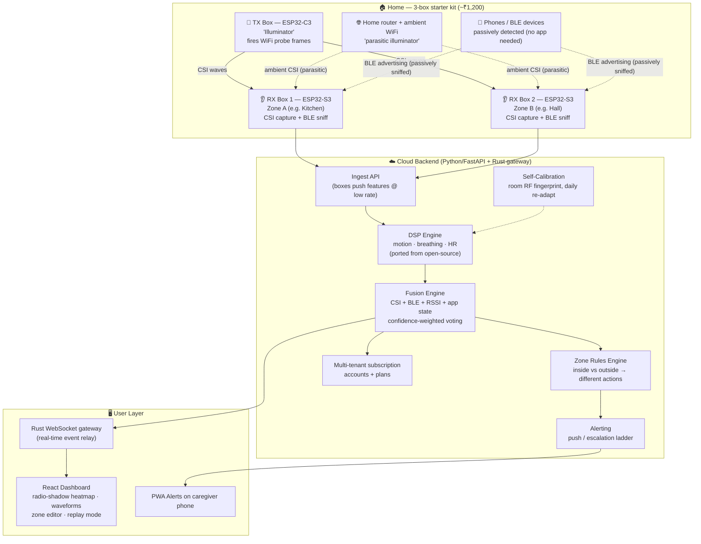
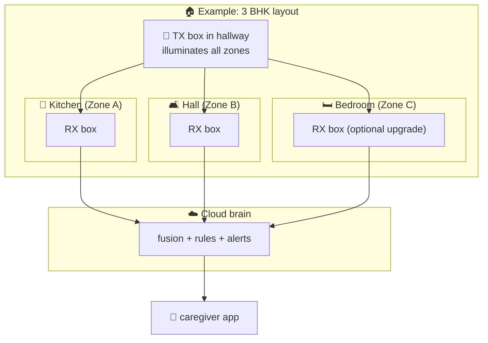
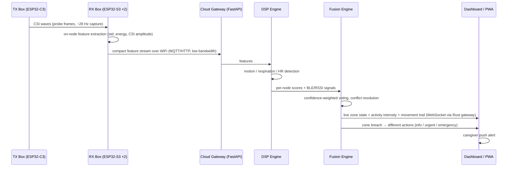
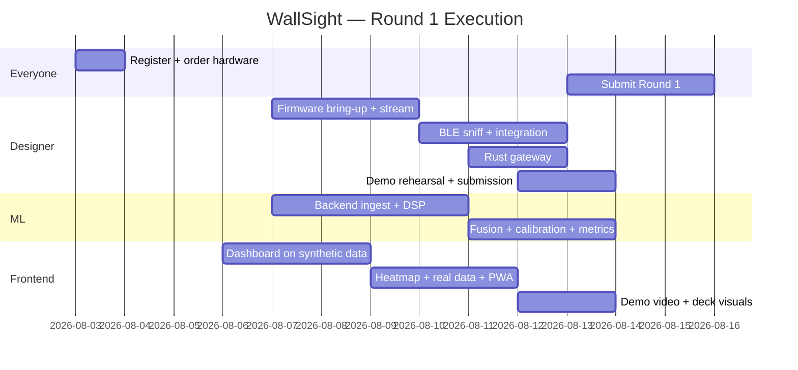

# WALLSIGHT

### RF-Fusion Ambient Sensing — The House That Sees Without Watching

**Event:** LT HackFest 2026 (International, online) — Round 1 submission Aug 13–15, 2026
**Team:** 3 (System Designer · ML Engineer · Frontend) — Team name: **WallSight**
**Hardware budget:** ~₹1,200 · **Software cost:** ₹0 (all open source)

---

> **THE ONE-LINER**
>
> *"Every home already fills itself with Wi-Fi. WallSight turns that radio into a silent guardian — it feels a toddler cross the doorway at 2 AM, hears grandma's breathing through a wall, and alerts your phone. No camera. No mic. No wearable. No phone required."*

---

## Table of Contents

1. [Executive Summary](#1-executive-summary)
2. [The Problem](#2-the-problem)
3. [The Physics — How It Works](#3-the-physics)
4. [What We're Building — System Architecture](#4-system-architecture)
5. [Deployment Model — Real Homes](#5-deployment-model)
6. [The 4 Innovation Pillars](#6-innovation-pillars)
7. [Features — What We Can Do](#7-features)
8. [Honest Limits — What We Cannot Do](#8-honest-limits)
9. [Data Pipeline](#9-data-pipeline)
10. [Hardware & Costs](#10-hardware--costs)
11. [What We Need](#11-what-we-need)
12. [Business Model](#12-business-model)
13. [The Demo](#13-the-demo)
14. [Team Roles & Responsibilities](#14-team-roles)
15. [Timeline & Milestones](#15-timeline)
16. [Competition Landscape](#16-competition)
17. [Risks & Fallbacks](#17-risks)
18. [Submission Checklist](#18-submission-checklist)
19. [Pitch Deck Outline](#19-pitch-deck)
20. [Repos & Stack Reference](#20-repos--stack)

---

## 1. Executive Summary

**WallSight** is a device-free human-sensing system built on **WiFi-CSI (Channel State Information)** — the same radio waves every home already has. A set of small plug-and-play boxes (~₹400 each) turns ordinary WiFi signals into a sensor network that can **detect presence, motion, breathing, heart-rate (experimental), room zones, and cross-room movement through walls** — with **no cameras, no microphones, no wearables, and no phone needed from the person being monitored**.

The intelligence lives in the **cloud** (subscription model), so the hardware stays dumb and cheap. Phones and BLE devices in the home become *passive participants* in the sensing ecosystem — the boxes detect them, and their signals vote alongside the WiFi data to confirm what's happening.

**Why this wins:** every existing safety solution requires the person to participate (wear a watch, carry a phone, stand in front of a camera). WallSight requires **nothing**. That single insight — "device-free sensing, privacy by physics" — is the whole pitch.

---

## 2. The Problem

### 2.1 Who suffers
| Person | The failure |
|---|---|
| **Dementia patient** | Wanders out at night; wears nothing; family asleep. Watches fail (privacy, no through-wall), wearables get ripped off |
| **Toddler** | Crosses toward the kitchen/stairs at 2 AM; no one can watch 24×7 |
| **Elderly parent** | Falls, or stops breathing in their room; found hours later — the "long lie" |
| **Family** | Can't afford 24×7 caregivers; cameras invade everyone's privacy; alerts that need *the person to cooperate* don't work |

### 2.2 Why existing solutions fail
| Solution | Why it fails |
|---|---|
| **Cameras / CCTV** | Privacy nightmare (bathroom, bedroom, guests); no through-wall; everyone hates them |
| **Wearables (watches, pendants, tags)** | Dementia patients remove them; toddlers won't keep them; batteries die; **"judges have seen this a thousand times"** |
| **Pressure mats / PIR sensors** | Single point, no through-wall, no breathing/heart signal, no tracking, cheap-looking |
| **mmWave radar modules** | Slightly better, but still commercial off-the-shelf demos — well-trodden hackathon ground |
| **UWB beacons/tags** | ₹2,500+/module, needs the person to carry a tag — same participation flaw |

### 2.3 The insight
> Every existing system requires the person to **participate**. WallSight requires **nothing** from the person — the room itself becomes the sensor.

---

## 3. The Physics

### 3.1 What CSI is
WiFi doesn't travel point-to-point like a laser. It **radiates in all directions** and **bounces off everything** — walls, furniture, and people. The receiver sees not one signal but a *soup of reflected copies* of the signal. **CSI = Channel State Information** — a per-subcarrier measurement of how that soup changes over time (amplitude + phase).

### 3.2 Why a person is detectable
A moving person **disturbs the reflected paths**:
- **Motion** (walking, waving, breathing chest) → shifts the reflections → measurable CSI changes (Doppler)
- **Static presence near the line** → attenuates the direct path
- **Through walls** → 2.4 GHz penetrates drywall/wood (and 1 brick wall)

An ESP32 receiver capturing CSI at ~10–30 Hz (config-dependent) can see this in real time.

### 3.3 Sensing geometry — not a line, not a circle, an "egg"



- **On/near the line** → strongest signal (breathing, heart-rate, crossing detection)
- **Anywhere in the room** → detected via reflections (motion)
- **Through walls** → waves penetrate (presence in the next room)
- **Concrete floor slabs** → ❌ block 2.4 GHz — each floor needs its own boxes

### 3.4 The 30-second explanation (memorize this)
> *"WiFi signals bounce off everything. When a person moves — even just breathes — they disturb those bounces. WallSight's boxes listen to the radio field and read the disturbance. The person becomes a shadow in the radio waves. We just visualize that shadow."*

---

## 4. System Architecture



### 4.1 Key design decisions
| Decision | Why |
|---|---|
| **Dumb boxes, smart cloud** | ₹400 nodes + zero edge compute → subscription business model works; processing scales server-side |
| **3 boxes for Round 1** | 1 TX + 2 RX = 2 zones → enables zone-tracking + inside/outside behavior demo (minimum for our features) |
| **Python backend (not Rust)** | wifi-ghost/ThroughNet algorithms are Python/NumPy — porting to Rust costs 3–4 days we don't have |
| **Rust microservice** | A real Rust component (WebSocket gateway) — designer's learning goal, off the critical path |
| **Dashboard works on synthetic data from day 1** | Frontend never blocks on hardware; demo never depends on live accuracy |
| **Ready-made firmware, not from scratch** | `espressif/esp-csi` + `heyfinal/wifi-ghost` ship working ESP32 firmware → "flash + configure + stream" instead of "write" |

---

## 5. Deployment Model

One box per room/zone, like Wi-Fi extenders. Coverage math:

| Home type | Zones | Boxes (RX + TX) | Hardware cost |
|---|---|---|---|
| 1 BHK / studio | 2 | 2 RX + 1 TX = **3** | ~₹1,200 |
| **3 BHK Indian** (~1,300 sq ft) | 5 | 5 RX + 2 TX = **7** | ~₹3,000 |
| US home (~2,500 sq ft) | 7–9 | 7–9 RX + 2–3 TX | ~₹4,000–5,000 |
| 3-storey mansion | per floor × 3 | scales linearly (concrete slabs block RF) | ~₹1,500/floor |



**Scaling story (pitch slide):** *"one box per room, like Wi-Fi extenders — your home's WiFi already lives everywhere; we just make it feel."*

---

## 6. Innovation Pillars

### Pillar 1 — Parasitic Sensing
RX boxes in monitor mode capture CSI from **any** transmitter — the home router, smart TVs, even the neighbor's WiFi bleeding through walls. Our TX box is a *booster*, not a necessity. *We sense using radio that already exists in the walls — including signals we never sent.*

### Pillar 2 — Radio-Shadow Visualization ("RF skeleton")
No camera → we render what the radio sees: a **radar-style activity view** of the room — per-zone energy glow, the person as a moving shadow-blob, and a movement trail, with the breathing waveform overlaid. Honest framing: it's a **zone-level energy visualization**, not true spatial localization (2 RX boxes can't triangulate) — we never fake precision. A "skeleton of RF, not pixels."

### Pillar 3 — Ecosystem Fusion (every device votes)
```
CSI boxes (fine) + WiFi RSSI (coarse) + BLE sniff (phones/watches/earbuds) + phone app state (opt-in)
        └──────────────▶ Cloud fusion engine ◀──────────────┘
     each source scores "is someone in zone X" → confidence-weighted vote
     conflict resolution: "CSI says hall, BLE says phone in kitchen → engine decides"
```

### Pillar 4 — Self-Calibrating Baseline
Auto-learns each room's RF fingerprint (walls, furniture), re-adapts daily, flags "environment changed" instead of false-alarming. **No install engineer, no calibration app.**

---

## 7. Features

### Round 1 (must demo — Aug 13–15)
| # | Feature | Notes |
|---|---|---|
| 1 | Presence detection, device-free, through walls | Core |
| 2 | Motion detection (anywhere in room) | Doppler-based |
| 3 | Breathing rate (14–18 BPM) | Open-source verified — **star of the demo** |
| 4 | Doorway crossing detection | Strongest line |
| 5 | 2-zone occupancy ("Kitchen occupied") | |
| 6 | Zone-to-zone tracking (kitchen → hall trail) | |
| 7 | BLE device detection ("phone in kitchen") | Passive sniff, no app on that device |
| 8 | Inside vs outside zone → different alert actions | Rules engine |
| 9 | Radio-shadow activity view | Zone-energy heatmap + movement trail (full render) |
| 10 | Self-calibration baseline | |
| 11 | Replay mode (recorded CSI) | Demo safety net |
| 12 | Local fallback (single box + home router) | |
| 13 | Subscription-structured multi-tenant backend | Business model is real code |

### Round 2 (if we advance)
| Feature | Honest status |
|---|---|
| Heart rate (bandpass 0.8–2.0 Hz FFT) | Experimental — labeled, never faked |
| Fall-then-stillness heuristic | "sudden motion → zero motion" heuristic, NOT a real fall detector |
| Apnea alert (breathing stopped) | |
| Abnormal breathing/HR rate alerts | |
| Escalation ladder (push → SMS/email → all caregivers) | |
| Caregiver family groups (multi-user per home) | |
| Event history timeline (signed audit) | |
| Night/quiet mode | |
| Consent-based phone participation + random-MAC handling | |
| CSV data export | |

### Roadmap
| Feature | Notes |
|---|---|
| OpenWrt router as extra RX node | $30 router becomes a high-gain sensing node |
| Co-crystal C3+S3 clock-synced boxes | Espressif reference design — phase data |
| Room-level triangulation (multi-RX) | |
| Firmware OTA updates | |
| Offline buffering | |
| Multi-home management in one app | |

---

## 8. Honest Limits

> ⚠️ **Know these cold. Judges will probe them. Never overclaim — "we know our limits" is a strength.**

| Question | Honest answer |
|---|---|
| "Can it detect a fall?" | Only a *sudden-motion-then-stillness* heuristic — **not** a reliable fall detector. Labeled honestly. |
| "What's the accuracy?" | We publish our **own measured numbers** (e.g., "94% zone occupancy, 0 false positives in X-hour test"). |
| "Through concrete floors?" | ❌ No — 2.4 GHz blocked by slabs. Boxes per floor, like Wi-Fi extenders. |
| "Through how many walls?" | ~1 brick wall reliably; 2 marginal. Drywall (US homes) easier. |
| "Can it identify WHO?" | ❌ No identity from CSI. Optional person-ID only via their phone's BLE MAC (consent-based). |
| "Is the heatmap a camera?" | ❌ It's rendered **from radio data** — a visualization, not pixels. Nothing is recorded visually. |
| "Can it localize the person precisely?" | ❌ **Room-level only.** The heatmap is zone-energy + movement trail, not true positioning — 2 RX boxes can't triangulate precisely. We never fake precision. |
| "RuView already does this — why you?" | ✅ We know — 83K stars proves the tech. RuView is a free DIY edge platform (no app, no cloud, no India); **we ship the consumer product** around it. |
| "Is heart rate real?" | Research-grade, fragile in live demo → we demo **breathing** as the star; HR = experimental. |
| "Range?" | ~10–15 ft per TX–RX pair. A per-room system, not outdoor/whole-building. |
| "Why not a ₹5 PIR sensor?" | PIR: no through-wall, no breathing, no zones, no tracking, no data richness. Different product class. |
| "Does it need the person to carry anything?" | **No. Nothing. That's the entire point.** |
| "Does it work if the person is perfectly still?" | Static presence works **near the line**; still-person detection off-axis is weak — honest limit. |
| "Privacy?" | No camera/mic/wearable. Features-only streaming (raw CSI not stored), encrypted transport, retention controls, consent-based phone participation. |
| **"Why this when every home already has cameras with motion detection?"** | **Different product class:** a camera answers *"what happened"* (forensics, after the fact, one FoV, fails at night/behind doors, no vitals, stores hackable pixels, family-hostile in bedrooms). WallSight answers *"is the person okay right now"* — through walls, in the dark, under the blanket: breathing, no-motion, zone breach. Privacy by physics — no image ever exists. Cost: one camera ≈ our whole-house kit. Honest concession: for thief *identification* cameras win — we're not replacing them, we fill the gap they can't touch, and "we tell you WHEN to look, not make you watch 24×7." |

---

## 9. Data Pipeline



**Bandwidth honesty:** boxes transmit compact features, not raw CSI dumps → cheap, battery-friendly, subscription-viable at scale.

---

## 10. Hardware & Costs

| Item | Qty | Unit cost | Total | Source |
|---|---|---|---|---|
| ESP32-S3 SuperMini (RX boxes) | 2 | ~₹400 | ~₹800 | Amazon / robu.in / Delhi market |
| ESP32-C3 SuperMini (TX box) | 1 | ~₹300 | ~₹300 | same |
| USB-C cables + jumpers | misc | — | ~₹100 | local |
| **Total out-of-pocket** | | | **≈ ₹1,200** | |

- **Cloud:** ₹0 — free tiers (Render/Railway) + localhost for the demo
- **Software:** ₹0 — 100% open source
- **Total prize pool of the hackathon: ₹25,45,000** — 1st place ₹2,50,000; top 100 paid (51st–100th = ₹15,000 each)

---

## 11. What We Need

### Buy (ORDER TODAY — Aug 3 at the latest; 3–5 day shipping)
- 2× ESP32-S3 SuperMini
- 1× ESP32-C3 SuperMini
- USB-C cables

### Accounts (free)
- GitHub (public repo for submission)
- Render/Railway (optional — localhost works for demo)

### Repos to clone (all open source)
| Repo | What we take from it |
|---|---|
| `espressif/esp-csi` | Official ESP32 CSI capture (all ESP32 chips supported: ESP32/S2/C3/S3/C5/C6/C61) |
| `heyfinal/wifi-ghost` | Working 2× ESP32-WROOM firmware + Python motion/respiration algorithms (verified 14–18 BPM through wall) |
| `Adichapati/ThroughNet` | Multi-node CSI fusion reference (100% detection / 0% false positive on ESP32-S3) |
| `ruvnet/RuView` (~83K stars, Rust) | Proof the tech works (presence/breathing/HR) — study, don't clone; we build the product around it |

### Skills in team
| Skill | Who |
|---|---|
| ESP-IDF / C firmware (adapt, not write) | Designer |
| Python + NumPy/SciPy DSP | ML guy |
| React / TS dashboard | Frontend |
| Rust (small gateway service) | Designer |
| System architecture + integration | Designer |
| Pitching / video / design | Frontend + Designer |

### Time
~30 focused hours per person until Aug 13.

---

## 12. Business Model

### Why subscription
- Hardware is dumb + cheap (₹300–400/node); **all intelligence is cloud-side** → recurring revenue, low COGS, scales to any home size
- The architecture IS the business model — multi-tenant accounts, plans, device groups from day 1

### Plans
| Plan | Boxes | Price |
|---|---|---|
| **Starter** | 3-box | ₹199/mo |
| **Family** (3 BHK) | 7-box | ₹499/mo |
| **Estate** | N-box | custom |

### Market
- 40M+ seniors in India living with family; wandering/falls are top caregiver fears
- B2B2C: elder-care providers, assisted-living centers, hospital dementia wards
- Daycares (toddler safety), pet-monitoring adjacent later
- Global: 1.4B+ connected homes; WiFi-sensing commercial players (Origin Wireless) are enterprise-priced, not consumer

### COGS
| Item | Cost |
|---|---|
| 3 BHK hardware kit | ~₹3,000 |
| Server per home | ~₹0 (free-tier architecture; near-zero marginal) |
| **Gross margin** | ~90%+ at ₹499/mo |

### Competition framing (slide)
*"RuView (83K stars) and Origin Wireless proved WiFi sensing works. But RuView is a free DIY platform for hobbyists — English, Home-Assistant world, edge-only, no cloud, no app — and Origin is enterprise-priced. Neither ships a consumer product for families. We're the ₹1,200 + ₹199/mo product: caregiver app, cloud subscription, BLE fusion, 10-minute setup."*

---

## 13. The Demo

### 5-minute video script
| # | Scene | On-screen |
|---|---|---|
| 1 | Empty room | Dashboard: `ALL ZONES CLEAR` |
| 2 | Person walks in | Shadow-blob appears on **heatmap** → `KITCHEN OCCUPIED` |
| 3 | Phone placed on table | `DEVICE DETECTED: phone in kitchen (BLE)` |
| 4 | Person sits still | Live breathing waveform: **16 BPM** |
| 5 | Person crosses doorway | `CROSSING EVENT` |
| 6 | Simulated 2 AM zone breach | Urgent escalation → daughter's phone |
| 7 | Close | *"No camera. No mic. No wearable. The WiFi in your walls felt everything."* |

### Recording safety
- Every scene rehearsed with **replay mode** (recorded data) → the demo NEVER fails live
- Live shots included but optional in the edit

---

## 14. Team Roles

| Person | Role | Owns | Deliverable by |
|---|---|---|---|
| **System Designer (you)** | Architect + integrator | Firmware bring-up (flash/adapt ready-made code), stream format, Rust WebSocket gateway, integration between layers, hardware ordering, demo coordination, pitch narrative, **submission** | Working 3-box CSI stream by **Aug 10** |
| **ML guy** | Algorithms | Python FastAPI backend: ingest, DSP port (motion/resp/HR), fusion engine, self-calibration, **accuracy metrics for pitch** | Live backend + measured numbers by **Aug 11** |
| **Frontend** | Product surface | React dashboard (floor-plan editor, heatmap, waveforms, zone editor, alert feed, replay), PWA alerts, demo video editing, deck visuals | Dashboard on synthetic data by **Aug 7**, real data by **Aug 11**, video by **Aug 12** |

**Coordination rules:**
- Daily 15-min sync; everyone's deliverable is independently demoable until integration day
- Frontend builds against synthetic data from day 1 — never blocks on hardware
- One shared GitHub repo, one architecture doc (this file)

---

## 15. Timeline

| Date | Milestone |
|---|---|
| **Aug 3** | ✅ **Order boards NOW** (3–5 day shipping) |
| **Aug 3–4** | ✅ Register at softechitsolution.in/register (Unstop listing closes Aug 5) |
| **Aug 6–8** | Boards arrive · flash esp-csi firmware · CSI streams to laptop |
| **Aug 9** | Backend ingest API consumes live CSI · dashboard shows synthetic data |
| **Aug 10** | Motion detected from live stream · stream format frozen |
| **Aug 11** | Fusion engine (CSI+BLE) · breathing waveform live · accuracy numbers |
| **Aug 12** | Full system: 2 zones + heatmap + BLE + alerts · rehearsal · record demo |
| **Aug 13–15** | **Round 1 submission** (video + repo + deck + dashboard link) |
| Aug 21–22 | Round 2 evaluation (if advanced) |
| Aug 28–30 | Round 3 finals (if advanced) |



---

## 16. Competition

### What exists (we surveyed ~30 domains)
| Domain | Existing | Verdict |
|---|---|---|
| Digital-arrest scam detection | CyberDudeBivash triage | Saturated — avoided |
| Emergency vehicle preemption | SmartEVP+ | Saturated — avoided |
| Photo provenance (C2PA) | TrueShot | Saturated — avoided |
| Cold-chain tamper boxes | ColdProof, LogiChain360 | Saturated — avoided |
| E-nose food freshness | FoodSense-AI | Saturated — avoided |
| AI stethoscope | RevoScope, CardioScan | Saturated — avoided |
| IMU sports analytics | multiple papers/projects | Saturated — avoided |
| EMG gesture | EMGBand, MyoPilot | Saturated — avoided |
| mmWave fall detection | CircuitDigest proj, Veriprajna | Saturated — avoided |
| Acoustic pipe leak | Sentinel, AquaSense, Leakio | Saturated — avoided |
| ESP32 smart-home firewall | T800, ShadowSentryS3 | Saturated — avoided |
| UWB indoor positioning | tutorials + ₹2,500/modules | Too expensive — avoided |
| Elder/toddler safety as a consumer product (India) — tech proven by RuView, no one ships the product | **Product lane open** | **We build this** |

### Our direct lineage (algorithm-level)
- **RuView** (~83K stars, Rust-first): the platform that proves WiFi sensing works — presence, breathing, HR on ESP32 meshes, even a DensePose-like radio visualization. Free + open-source, edge-only, no cloud, no consumer app, no India presence → **we build the product it never built**
- **Origin Wireless**: commercial enterprise WiFi sensing — expensive, not consumer, not India
- **wifi-ghost / ThroughNet**: working open-source ESP32 builds we stand on

### Why judges haven't seen this from students
Judges have likely seen RuView's tech demos — but shipping it as an **India-market consumer safety product** (caregiver app, cloud subscription, BLE fusion, ₹1,200 kit) is not something student teams present. We stand on RuView's shoulders honestly and differentiate on **product**, not raw tech.

---

## 17. Risks & Fallbacks

| Risk | Probability | Mitigation |
|---|---|---|
| Boards arrive late | Med | Order **Aug 3** (today); Delhi/UP electronics markets stock ESP32-S3; fallback = single board + home router mode |
| wifi-ghost firmware targets classic ESP32, not S3/C3 | Med | Base firmware on `esp-csi` examples (chip-agnostic); port wifi-ghost's **Python DSP** only |
| CSI flaky in room | Med | **Replay mode** — demo runs recorded data; live is bonus |
| BLE + WiFi concurrency issues | Med | Time-shared scans; BLE is auxiliary not critical |
| Heart rate fails live | High | Breathing is the star; HR labeled experimental |
| ML guy's DSP port slips | Med | wifi-ghost ships runnable Python — port is configuration, not research |
| Team time conflict | Med | Independent deliverables until integration day; 15-min daily sync |
| Cloud tier limits | Med | Demo on localhost + screen recording; subscription architecture shown, not hosted at scale |
| Registration misses deadline | Low | Register **before Aug 6** — done by designer day 1 |

---

## 18. Submission Checklist

- [ ] Register team "WallSight" at https://softechitsolution.in/register (**by Aug 4** — Unstop listing closes Aug 5)
- [ ] Boards ordered (**Aug 3**) and received (by Aug 8)
- [ ] Public GitHub repo: code + README + architecture diagrams (this doc becomes the README base)
- [ ] 5-minute demo video (scripted, replay-backed, edited)
- [ ] Pitch deck (slide outline below)
- [ ] Dashboard live link or screen recording
- [ ] Measured accuracy numbers from ML guy
- [ ] All teammates' contact details on the registration form

---

## 19. Pitch Deck Outline

1. **Hook** — one-liner + 10-second video of shadow-blob detection
2. **Problem** — the 2 AM wandering toddler / fallen grandma; participation-flaw of existing tech
3. **Physics in 30s** — "WiFi bounces; we read the bounces" (diagram)
4. **The 4 innovation pillars** — parasitic sensing · radio-shadow · ecosystem fusion · self-calibration
5. **Live demo** (video or recorded)
6. **Architecture** — dumb boxes → cloud brain → app (diagram)
7. **Accuracy + honest limits** — our numbers; "we know what we can't do"
8. **Business model** — subscription tiers, COGS, market size, ~90% margin
9. **Competition** — RuView/Origin exist at enterprise price; we're the consumer version; open lane
10. **Roadmap** — heart rate, OpenWrt nodes, triangulation, OTA
11. **Team** — designer · ML · frontend, why we're the right trio
12. **Ask** — seed for box production / pilot with a care home

---

## 20. Repos & Stack Reference

### Stack
| Layer | Tech |
|---|---|
| Firmware | ESP-IDF (C), `espressif/esp-csi`, adapted wifi-ghost firmware |
| Backend | Python FastAPI + NumPy/SciPy (DSP), ported wifi-ghost/ThroughNet algorithms |
| Real-time relay | Rust (WebSocket gateway) — designer's component |
| Frontend | React + TS, heatmap render (Canvas), zone editor |
| Mobile | PWA (installable, push alerts) |
| Cloud | Render/Railway free tier or localhost |
| Transport | MQTT/HTTP features streaming, WebSocket live updates |

### References
- Hackathon registration: https://softechitsolution.in/register
- Hackathon info: LT HackFest 2026 — LT Supercom India Pvt Ltd + EpochFolio (also on Unstop: "International Hackathon Competition 2026")
- esp-csi: https://github.com/espressif/esp-csi
- wifi-ghost: https://github.com/heyfinal/wifi-ghost
- ThroughNet: https://github.com/Adichapati/ThroughNet
- RuView: https://github.com/ruvnet/RuView (83K stars — presence/breathing/HR on ESP32, Rust core; study for reference)

---

*Document status: ✅ FINAL — approved by team lead. Update on integration-day findings.*
